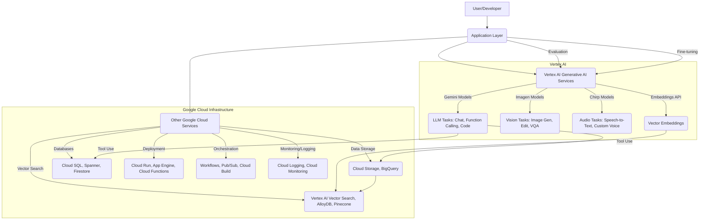

<!--
  Generated by AI-Powered README Generator
  Repository: https://github.com/GDSC-FSC/generative-ai
  Generated: 2025-10-07T18:04:28.055Z
  Format: md
  Style: comprehensive
-->

# Generative AI on Google Cloud

[](LICENSE)
[](https://github.com/GDSC-FSC/generative-ai/actions)
[](https://cloud.google.com/vertex-ai/generative-ai/docs/models/gemini/2-5-pro)
[](https://github.com/GDSC-FSC/generative-ai)

**Accelerating Generative AI development and innovation with Vertex AI on Google Cloud.**

This comprehensive repository provides an extensive collection of notebooks, code samples, sample applications, and essential resources to help you leverage and build powerful Generative AI workflows using [Generative AI on Google Cloud](https://cloud.google.com/ai/generative-ai), powered by [Vertex AI](https://cloud.google.com/vertex-ai).

---

## 📖 Table of Contents

*   [Overview / Introduction](#-overview--introduction)
*   [Feature Highlights](#-feature-highlights)
    *   [Gemini Model Capabilities](#gemini-model-capabilities)
    *   [Multimodal Generative AI](#multimodal-generative-ai)
    *   [AI Application Development](#ai-application-development)
    *   [Data & MLOps for Generative AI](#data--mlops-for-generative-ai)
*   [Architecture / Design / Modules](#-architecture--design--modules)
    *   [High-Level Architecture](#high-level-architecture)
    *   [Core Components & Responsibilities](#core-components--responsibilities)
    *   [Technology Stack](#technology-stack)
*   [Getting Started / Installation / Setup](#-getting-started--installation--setup)
    *   [Prerequisites](#prerequisites)
    *   [General Setup (Google Cloud & Vertex AI SDK)](#general-setup-google-cloud--vertex-ai-sdk)
    *   [Repository Cloning](#repository-cloning)
    *   [Environment Variables](#environment-variables)
    *   [Running Notebooks](#running-notebooks)
    *   [Running Sample Applications](#running-sample-applications)
*   [Usage / Workflows / Examples](#-usage--workflows--examples)
    *   [Gemini Chat Completions](#gemini-chat-completions)
    *   [Function Calling with Gemini](#function-calling-with-gemini)
    *   [Multimodal RAG](#multimodal-rag)
    *   [Image Generation with Imagen](#image-generation-with-imagen)
    *   [Speech-to-Text & Custom Voice with Chirp](#speech-to-text--custom-voice-with-chirp)
*   [Limitations, Known Issues & Future Roadmap](#-limitations-known-issues--future-roadmap)
    *   [Current Limitations](#current-limitations)
    *   [Known Issues](#known-issues)
    *   [Future Roadmap](#future-roadmap)
*   [Contributing & Development Guidelines](#-contributing--development-guidelines)
    *   [How to Contribute](#how-to-contribute)
    *   [Branching and Pull Request Guidelines](#branching-and-pull-request-guidelines)
    *   [Code Style and Quality](#code-style-and-quality)
    *   [Development Setup](#development-setup)
*   [License, Credits & Contact](#-license-credits--contact)
*   [Appendix / Optional Extras](#-appendix--optional-extras)
    *   [Changelog](#changelog)
    *   [Frequently Asked Questions (FAQ)](#frequently-asked-questions-faq)
    *   [Troubleshooting](#troubleshooting)
    *   [API Reference Links](#api-reference-links)
    *   [Related Repositories](#related-repositories)

---

## 👋 Overview / Introduction

This repository serves as a central hub for practical demonstrations and best practices for implementing Generative AI solutions on Google Cloud. It's designed to help developers, machine learning engineers, and data scientists rapidly explore, prototype, and deploy cutting-edge AI applications.

The core purpose of this collection is to demystify the complexities of working with large language models (LLMs) and other generative models. It addresses the common challenge of translating theoretical AI concepts into production-ready solutions by providing concrete, tested examples that cover a wide range of use cases and technical integrations.

**Key Goals:**
*   **Showcase Capabilities:** Demonstrate the full power of Vertex AI's Generative AI offerings, including Gemini, Imagen, and Chirp.
*   **Accelerate Development:** Provide ready-to-use code, notebooks, and applications that serve as a starting point for your projects.
*   **Educate & Inspire:** Offer detailed examples and explanations to foster understanding and encourage innovation in the Generative AI space.
*   **Promote Best Practices:** Highlight effective patterns for model interaction, data handling, evaluation, and deployment within the Google Cloud ecosystem.

**Target Audience:**
*   **AI/ML Developers:** Looking for hands-on examples to build their own Generative AI applications.
*   **Data Scientists:** Interested in experimenting with and fine-tuning generative models.
*   **Solution Architects:** Seeking reference architectures and integration patterns for Google Cloud Generative AI services.
*   **Researchers:** Exploring advanced model capabilities and new application areas.

[Back to top](#-table-of-contents)

---

## ✨ Feature Highlights

This repository covers a vast array of Generative AI capabilities and application patterns. Here are some of the key feature highlights:

### Gemini Model Capabilities

*   **Model Introductions (2.5 Pro & Flash):** Get started with the latest Gemini models, including [`intro_gemini_2_5_pro.ipynb`](gemini/getting-started/intro_gemini_2_5_pro.ipynb) and [`intro_gemini_2_5_flash.ipynb`](gemini/getting-started/intro_gemini_2_5_flash.ipynb).
*   **Chat Completions & Conversational AI:** Build dynamic chatbots and interactive experiences with contextual understanding.
*   **Function Calling:** Enable Gemini models to interact with external tools and APIs, automating complex workflows.
    *   🔍 Explore [`intro_function_calling.ipynb`](gemini/function-calling/intro_function_calling.ipynb) for a deep dive.
    *   🚀 See the `sql-talk-app` and `function_calling_service` examples for practical implementations.
*   **Code Execution & Generation:** Leverage Gemini's capabilities for code understanding, generation, and execution.
    *   💡 Check out [`intro_code_execution.ipynb`](gemini/code-execution/intro_code_execution.ipynb).
*   **Context Caching & Long Context:** Optimize performance and handle extensive conversations with context caching and long-context windows.
*   **Controlled Generation:** Guide model output with parameters and constraints for more predictable results.
*   **Responsible AI:** Learn about prompt attacks mitigation, safety ratings, and best practices for ethical AI development.
    *   ⚠️ See [`gemini_safety_ratings.ipynb`](gemini/responsible-ai/gemini_safety_ratings.ipynb).

### Multimodal Generative AI

*   **Image Generation & Editing (Imagen):** Create stunning images from text prompts, perform inpainting, outpainting, and other edits.
    *   ✅ Examples in [`vision/getting-started/`](vision/getting-started/) like [`imagen3_image_generation.ipynb`](vision/getting-started/imagen3_image_generation.ipynb).
*   **Multimodal RAG:** Combine text and image data for enhanced Retrieval Augmented Generation, allowing models to answer questions based on rich, diverse content.
    *   💡 Dive into [`intro_multimodal_rag.ipynb`](gemini/use-cases/retrieval-augmented-generation/intro_multimodal_rag.ipynb).
*   **Video Analysis & Generation (Veo):** Analyze video content and explore video generation capabilities.
*   **Speech (Chirp API):** Integrate advanced speech-to-text and custom voice generation for audio applications.
    *   🚀 Get started with [`get_started_with_chirp_2_sdk.ipynb`](audio/getting-started/get_started_with_chirp_2_sdk.ipynb).

### AI Application Development

*   **Agents & Orchestration:** Build sophisticated multi-agent systems using frameworks like LangChain, LlamaIndex, CrewAI, and LangGraph.
    *   [`gemini/agent-engine/`](gemini/agent-engine/) provides comprehensive examples.
    *   The `genai-experience-concierge` sample app demonstrates complex agent interactions.
*   **RAG Engine:** Implement robust Retrieval Augmented Generation solutions using various vector databases (Vector Search, Pinecone, AlloyDB, Weaviate) and Vertex AI Search.
    *   🔍 See [`rag-engine/`](gemini/rag-engine/) for diverse examples.
*   **Vertex AI Search Integration:** Develop powerful search experiences over your enterprise data with Google-managed solutions.
*   **Genkit Framework:** Leverage Genkit for streamlined development, deployment, and operation of AI applications.
    *   🚀 Explore examples in [`genkit/`](genkit/).
*   **Sample Applications:** Deploy full-stack Generative AI applications using Streamlit, FastAPI, Next.js, and more on Cloud Run or App Engine.
    *   Examples include `autocal`, `fixmycar`, `genwealth`, `llamaindex-rag`.

### Data & MLOps for Generative AI

*   **Embeddings & Vector Search:** Generate high-quality embeddings and perform efficient vector search for similarity and outlier detection.
    *   Start with [`intro-textemb-vectorsearch.ipynb`](embeddings/intro-textemb-vectorsearch.ipynb).
*   **Model Tuning (SFT):** Fine-tune Gemini models for specific tasks like QA, summarization, or image captioning.
*   **Evaluation Services:** Rigorously evaluate model performance, prompt effectiveness, and agent behavior with Vertex AI's evaluation SDK.
    *   ✅ Check out [`intro_to_gen_ai_evaluation_service_sdk.ipynb`](gemini/evaluation/intro_to_gen_ai_evaluation_service_sdk.ipynb).
*   **Batch Prediction:** Efficiently process large datasets with Gemini models for tasks like data generation or content moderation.
*   **Prompt Engineering & Optimization:** Discover best practices for crafting effective prompts and using prompt optimization tools.

[Back to top](#-table-of-contents)

---

## 🏛️ Architecture / Design / Modules

This repository showcases diverse architectural patterns, from simple notebook-based experiments to multi-service production-ready applications. The core design philosophy centers around leveraging managed services on Google Cloud and the Vertex AI platform for scalability, reliability, and ease of development.

### High-Level Architecture

The common pattern involves a user interacting with an application layer (notebook, web app, CLI), which then communicates with Vertex AI's Generative AI services (Gemini, Imagen, Chirp). Data storage, vector databases, and other supporting services are typically integrated as needed.



### Core Components & Responsibilities

*   **Application Layer:** (e.g., Jupyter Notebooks, Streamlit apps, FastAPI services, Next.js frontends, Flutter apps)
    *   Handles user interaction, orchestrates calls to Vertex AI, and integrates with other backend services.
    *   Many samples are provided in `gemini/sample-apps/`, `gemini/agents/`, `audio/sample-apps/`, etc.
*   **Vertex AI Generative AI Services:** (e.g., Gemini, Imagen, Chirp APIs)
    *   The core engine for generative tasks: text generation, image manipulation, speech processing, multimodal understanding.
    *   Accessed via the Vertex AI SDK (Python, Node.js) or REST APIs.
*   **Vertex AI Search:**
    *   Managed solution for building search engines over structured and unstructured data, often used for RAG.
    *   Located in the `search/` directory.
*   **Embeddings & Vector Databases:**
    *   `embeddings/` showcases generating vector embeddings for text and multimodal content.
    *   Integrated with solutions like Vertex AI Vector Search, BigQuery, AlloyDB, Pinecone, Weaviate for efficient similarity search and RAG.
*   **Google Cloud Infrastructure:**
    *   **Compute:** Cloud Run, Cloud Functions, GKE, Vertex AI Workbench for hosting applications and notebooks.
    *   **Data:** Cloud Storage for raw data, BigQuery for large-scale analytics, Cloud SQL/Spanner/Firestore for transactional/document data.
    *   **MLOps:** Vertex AI Pipelines for orchestration, Vertex AI Experiments for tracking, Vertex AI Evaluation for model quality.
    *   **Networking/Security:** VPC, IAM, Secret Manager.
    *   **Deployment:** Terraform for infrastructure as code (`gemini/autocal/terraform/`, `genkit/postcard-generator/terraform/`).

### Technology Stack

The examples in this repository utilize a diverse set of technologies, predominantly within the Google Cloud ecosystem:

*   **Programming Languages:** Python (primary), TypeScript/JavaScript, Java, Dart (Flutter).
*   **Frameworks & Libraries:**
    *   **AI/ML:** Vertex AI SDK, LangChain, LlamaIndex, Genkit, Gradio, Streamlit, CrewAI, LangGraph.
    *   **Web:** FastAPI, Quart, Next.js, Angular, Flutter.
    *   **Infrastructure:** Terraform, Docker.
*   **Google Cloud Services:**
    *   **Generative AI:** Vertex AI (Gemini, Imagen, Chirp), Vertex AI Search.
    *   **Compute:** Cloud Run, Cloud Functions, App Engine, Vertex AI Workbench.
    *   **Data:** BigQuery, Cloud Storage, Firestore, Cloud SQL (PostgreSQL), AlloyDB, Cloud Spanner.
    *   **Identity & Security:** IAM, Firebase Authentication, Secret Manager.
    *   **Deployment & MLOps:** Cloud Build, Cloud Logging, Vertex AI Pipelines, Vertex AI Evaluation.
*   **Diagramming:** Mermaid.js for architecture visualization.

[Back to top](#-table-of-contents)

---

## 🚀 Getting Started / Installation / Setup

This section guides you through setting up your environment to explore and run the examples in this repository.

### Prerequisites

Before you begin, ensure you have the following installed and configured:

*   **Google Cloud Project:** An active Google Cloud Project with billing enabled.
    *   💡 **Tip:** New users might be eligible for a [Google Cloud Free Tier](https://cloud.google.com/free) account.
*   **`gcloud` CLI:** The Google Cloud SDK installed and authenticated.
    ```bash
    gcloud auth login
    gcloud config set project YOUR_PROJECT_ID
    gcloud auth application-default login
    ```
*   **Python (3.9+):** Most notebooks and Python applications require Python 3.9 or higher.
    *   We recommend using `conda` or `venv` for environment management.
*   **`uv` (optional, but recommended):** A fast Python package installer and resolver.
    ```bash
    pip install uv
    ```
*   **Node.js (LTS):** Required for TypeScript/JavaScript-based applications and Genkit examples.
*   **Docker:** For building and deploying containerized applications.
*   **Terraform (optional):** For deploying infrastructure as code for some sample applications.

### General Setup (Google Cloud & Vertex AI SDK)

Most examples rely on the Vertex AI Python SDK.

<details>
<summary>Detailed Steps for Google Cloud and Vertex AI SDK Setup</summary>

1.  **Enable Necessary APIs:**
    Ensure the following APIs are enabled in your Google Cloud Project:
    *   `aiplatform.googleapis.com` (Vertex AI API)
    *   `cloudresourcemanager.googleapis.com`
    *   `artifactregistry.googleapis.com`
    *   `compute.googleapis.com`
    *   `storage.googleapis.com`
    *   `iam.googleapis.com`
    *   `cloudfunctions.googleapis.com`
    *   `run.googleapis.com`
    *   `vision.googleapis.com` (for Vision AI features if used directly)
    *   `language.googleapis.com` (for Natural Language API if used directly)
    *   `cloudbuild.googleapis.com`
    *   `servicenetworking.googleapis.com` (for private IP services like AlloyDB)

    You can enable them using the `gcloud` CLI:
    ```bash
    gcloud services enable \
        aiplatform.googleapis.com \
        cloudresourcemanager.googleapis.com \
        artifactregistry.googleapis.com \
        compute.googleapis.com \
        storage.googleapis.com \
        iam.googleapis.com \
        cloudfunctions.googleapis.com \
        run.googleapis.com \
        vision.googleapis.com \
        language.googleapis.com \
        cloudbuild.googleapis.com \
        servicenetworking.googleapis.com
    ```

2.  **Install Vertex AI Python SDK:**
    ```bash
    pip install google-cloud-aiplatform
    ```
    For specific features, you might need additional dependencies, e.g., for LLM frameworks:
    ```bash
    pip install langchain google-cloud-aiplatform[langchain]
    pip install llama-index google-cloud-aiplatform[llama-index]
    ```

3.  **Set up Environment for Notebooks:**
    Refer to the `setup-env/` directory for detailed instructions on setting up environments for Google Colab and Vertex AI Workbench.
</details>

### Repository Cloning

Clone this repository to your local machine:

```bash
git clone https://github.com/GDSC-FSC/generative-ai.git
cd generative-ai
```

### Environment Variables

Many examples rely on environment variables for configuration, especially `PROJECT_ID` and `REGION`. It's good practice to set these:

```bash
export PROJECT_ID="your-gcp-project-id"
export REGION="us-central1" # Or your preferred region
```

### Running Notebooks

Most examples are provided as Jupyter notebooks (`.ipynb` files).

1.  **Navigate to a notebook directory:**
    ```bash
    cd gemini/getting-started
    ```
2.  **Install dependencies (if any):**
    Each notebook might have its own `requirements.txt` or specific dependencies mentioned in the notebook itself. Install them in your active Python environment.
    ```bash
    uv pip install -r requirements.txt # or pip install -r requirements.txt
    ```
3.  **Launch Jupyter Lab/Notebook:**
    ```bash
    jupyter lab
    ```
    Or, open the notebook in Vertex AI Workbench or Google Colab.

### Running Sample Applications

Sample applications (e.g., in `gemini/sample-apps/`, `audio/sample-apps/`) often have their own `README.md` with specific installation and deployment instructions.

<details>
<summary>General Steps for Running a Sample Application (e.g., Streamlit, FastAPI on Cloud Run)</summary>

1.  **Navigate to the application directory:**
    ```bash
    cd gemini/sample-apps/gemini-streamlit-cloudrun
    ```
2.  **Review the application's `README.md`:** This will contain specific instructions for that particular application.
3.  **Install dependencies:**
    ```bash
    uv pip install -r requirements.txt
    ```
4.  **Run locally (if applicable):**
    *   For Streamlit apps: `streamlit run app.py`
    *   For FastAPI apps: `uvicorn main:app --reload`
5.  **Build Docker image:**
    ```bash
    docker build -t gcr.io/${PROJECT_ID}/your-app-name:latest .
    ```
6.  **Push to Artifact Registry:**
    ```bash
    docker push gcr.io/${PROJECT_ID}/your-app-name:latest
    ```
7.  **Deploy to Cloud Run:**
    ```bash
    gcloud run deploy your-app-name \
        --image gcr.io/${PROJECT_ID}/your-app-name:latest \
        --platform managed \
        --region ${REGION} \
        --allow-unauthenticated # or specify appropriate IAM
        --set-env-vars=PROJECT_ID=${PROJECT_ID},REGION=${REGION} # Pass environment variables
    ```
    Adjust parameters (memory, CPU, concurrency, service accounts) as needed.
</details>

[Back to top](#-table-of-contents)

---

## 💡 Usage / Workflows / Examples

This section provides a glimpse into common usage patterns and compelling examples found within the repository. Each sub-directory (`gemini/`, `vision/`, `audio/`, etc.) contains more detailed examples.

### Gemini Chat Completions

Interact with Gemini for multi-turn conversations, leveraging its contextual understanding.

```python
# gemini/getting-started/intro_gemini_chat.ipynb
import vertexai
from vertexai.generative_models import GenerativeModel, Part, ChatSession

vertexai.init(project="your-gcp-project-id", location="us-central1")
model = GenerativeModel("gemini-2.5-flash-001")
chat = model.start_chat()

def get_chat_response(chat: ChatSession, prompt: str) -> str:
    response = chat.send_message(prompt)
    return response.text

print(get_chat_response(chat, "Hello, what can you tell me about the latest Generative AI models?"))
print(get_chat_response(chat, "And what about their pricing?"))
```

### Function Calling with Gemini

Enable Gemini to perform actions by calling custom functions. This example demonstrates a simple function to get current weather.

```python
# Simplified example based on gemini/function-calling/intro_function_calling.ipynb
import vertexai
from vertexai.generative_models import GenerativeModel, Tool, FunctionDeclaration

vertexai.init(project="your-gcp-project-id", location="us-central1")

# Define a function to be called by the model
get_weather_func = FunctionDeclaration(
    name="get_current_weather",
    description="Get the current weather in a given location",
    parameters={
        "type": "object",
        "properties": {
            "location": {"type": "string", "description": "The city and state, e.g. San Francisco, CA"},
            "unit": {"type": "string", "enum": ["celsius", "fahrenheit"], "description": "The unit of temperature"},
        },
        "required": ["location"],
    },
)

# Create a tool containing the function
weather_tool = Tool(function_declarations=[get_weather_func])

model = GenerativeModel("gemini-2.5-flash-001", tools=[weather_tool])
chat = model.start_chat()

response = chat.send_message("What is the weather like in Boston, MA?")

# If Gemini decides to call the function, the response will contain a FunctionCall
if response.candidates[0].content.parts[0].function_call:
    function_call = response.candidates[0].content.parts[0].function_call
    print(f"Gemini wants to call: {function_call.name} with args: {function_call.args}")
    # In a real application, you would now execute this function and send the result back to Gemini.
else:
    print(response.text)
```

### Multimodal RAG

Combine text and image understanding for sophisticated Retrieval Augmented Generation.

```python
# Simplified example based on gemini/use-cases/retrieval-augmented-generation/intro_multimodal_rag.ipynb
import vertexai
from vertexai.generative_models import GenerativeModel, Part

vertexai.init(project="your-gcp-project-id", location="us-central1")
model = GenerativeModel("gemini-2.5-flash-001")

# Assume you have a document image and associated text chunks
image_part = Part.from_uri("gs://cloud-samples-data/generative-ai/image/scones.jpg", mime_type="image/jpeg")
text_chunk_1 = "This is a recipe for blueberry scones."
text_chunk_2 = "Ingredients include flour, sugar, butter, and blueberries."

prompt_parts = [
    text_chunk_1,
    image_part,
    text_chunk_2,
    "Based on the image and text, what kind of food is being described, and what are some key ingredients?"
]

response = model.generate_content(prompt_parts)
print(response.text)
```

### Image Generation with Imagen

Generate high-quality images from textual descriptions using Imagen on Vertex AI.

```python
# Simplified example based on vision/getting-started/imagen3_image_generation.ipynb
import vertexai
from vertexai.vision_models import ImageGenerationModel

vertexai.init(project="your-gcp-project-id", location="us-central1")
model = ImageGenerationModel.from_pretrained("imagegeneration@005") # Imagen 3

prompt = "A majestic castle nestled in a snowy mountain range, with a vibrant aurora borealis overhead, digital painting."

images = model.generate_images(
    prompt=prompt,
    number_of_images=1,
    seed=1234,
    aspect_ratio="16:9",
    # output_file_prefix="castle_aurora"
)

# images.save(location="output_directory") # To save images locally
print("Generated image successfully!")
```

### Speech-to-Text & Custom Voice with Chirp

Transcribe audio and explore custom voice capabilities with Vertex AI Chirp API.

```python
# Based on audio/getting-started/get_started_with_chirp_2_sdk.ipynb
import vertexai
from vertexai.generative_models import GenerativeModel, Part

vertexai.init(project="your-gcp-project-id", location="us-central1")
model = GenerativeModel("gemini-1.5-pro-001") # Gemini can be used to process transcribed text

# Assume you have an audio file in GCS
audio_part = Part.from_uri("gs://cloud-samples-data/generative-ai/audio/whale_audio.mp3", mime_type="audio/mp3")

prompt_parts = [
    audio_part,
    "What is the main topic of this audio? Summarize it in one sentence."
]

response = model.generate_content(prompt_parts)
print(response.text)

# For custom voice generation, refer to the Chirp documentation and specific notebooks
# like audio/getting-started/get_started_with_chirp3_instant_custom_voice.ipynb
```

[Back to top](#-table-of-contents)

---

## 🚧 Limitations, Known Issues & Future Roadmap

This repository is a living collection, continuously evolving with new models, features, and best practices.

### Current Limitations

*   **Regional Availability:** Some models or features showcased (e.g., specific Gemini versions, Imagen 3 capabilities) might have limited regional availability on Google Cloud. Always check the official documentation for the latest information.
*   **Quota Management:** Running numerous examples, especially those involving large-scale batch processing or high-volume API calls, might hit default Google Cloud quotas. Users may need to [request quota increases](https://cloud.google.com/docs/quotas/view-manage) for their projects.
*   **Cost Considerations:** While many examples utilize free-tier eligible services, extensive use of Generative AI models and other Google Cloud resources will incur costs. Always monitor your GCP billing dashboard.
*   **Model Versioning:** As Generative AI models are rapidly updated, some notebooks might reference older model versions. We strive to keep examples updated to the latest stable versions, but discrepancies may occur.

### Known Issues

*   **Dependency Conflicts:** Due to the wide range of tools and frameworks, occasional dependency conflicts might arise in complex multi-application setups. We recommend using isolated Python environments (`venv`, `conda`) for each project or notebook.
*   **API Changes:** Google Cloud APIs and client libraries are actively developed. Minor breaking changes or new functionalities might necessitate updates to older examples.
*   **Refer to GitHub Issues:** For the most up-to-date list of known issues and their resolutions, please check the [GitHub Issues](https://github.com/GDSC-FSC/generative-ai/issues) section of this repository.

### Future Roadmap

Our future plans for this repository include:

*   **Continuous Model Updates:** Integrating examples for newly released Gemini, Imagen, and Chirp models and features as they become available.
*   **Expanded Use Cases:** Adding more diverse and industry-specific Generative AI applications and workflows.
*   **Genkit Enhancements:** Further examples and patterns for building robust, observable, and production-ready AI applications with Genkit.
*   **Advanced RAG Patterns:** Exploring more sophisticated RAG techniques, including multi-stage retrieval, re-ranking, and adaptive chunking.
*   **Improved MLOps Integration:** Deeper integration with Vertex AI MLOps services for end-to-end Generative AI lifecycle management.
*   **Performance & Cost Optimization:** Examples demonstrating techniques for optimizing model inference, managing token usage, and reducing operational costs.

We welcome your feedback and feature requests! Please open a [GitHub Issue](https://github.com/GDSC-FSC/generative-ai/issues) if you have suggestions or encounter any problems.

[Back to top](#-table-of-contents)

---

## 🤝 Contributing & Development Guidelines

We welcome contributions to this repository! Your efforts help improve the quality, breadth, and utility of these Generative AI examples for the broader community.

### How to Contribute

1.  **Fork the Repository:** Start by forking the `GDSC-FSC/generative-ai` repository to your GitHub account.
2.  **Clone Your Fork:**
    ```bash
    git clone https://github.com/your-username/generative-ai.git
    cd generative-ai
    ```
3.  **Create a New Branch:**
    ```bash
    git checkout -b feature/your-feature-name-or-fix/your-fix-name
    ```
4.  **Make Your Changes:** Implement your feature, fix, or new example.
    *   Ensure your code adheres to the existing style and quality guidelines.
    *   Add clear comments and documentation where necessary.
    *   If adding a new notebook, ensure it's self-contained and runnable.
5.  **Test Your Changes:** Verify that your changes work as expected and do not introduce regressions.
6.  **Commit Your Changes:**
    ```bash
    git add .
    git commit -m "feat: Add new Gemini function calling example"
    ```
    Follow [Conventional Commits](https://www.conventionalcommits.org/en/v1.0.0/) for clear commit messages.
7.  **Push to Your Fork:**
    ```bash
    git push origin feature/your-feature-name-or-fix/your-fix-name
    ```
8.  **Open a Pull Request (PR):**
    *   Go to the original `GDSC-FSC/generative-ai` repository on GitHub.
    *   You should see an option to open a Pull Request from your branch.
    *   Provide a clear and concise description of your changes, referencing any relevant issues.
    *   Ensure all CI/CD checks pass.

### Branching and Pull Request Guidelines

*   **Branch Naming:** Use descriptive branch names like `feature/new-gemini-sdk-example`, `fix/broken-rag-notebook`, or `docs/update-installation-guide`.
*   **Pull Request Template:** Fill out the provided `PULL_REQUEST_TEMPLATE.md` to ensure all necessary information is included.
*   **Review Process:** All pull requests will be reviewed by maintainers. Be prepared to address feedback and make iterative improvements.

### Code Style and Quality

We maintain high code quality standards to ensure readability, maintainability, and consistency across the repository.

*   **Python:**
    *   **Linting:** We use `flake8` and `mypy`. Refer to `.github/linters/.flake8` and `.github/linters/.mypy.ini`.
    *   **Formatting:** We generally follow [PEP 8](https://www.python.org/dev/peps/pep-0008/).
*   **TypeScript/JavaScript:**
    *   **Linting:** `eslint`
    *   **Formatting:** `prettier` (see `.prettierrc`).
*   **Markdown:**
    *   We use `markdownlint`.
*   **Notebooks:**
    *   Ensure notebooks are clean, output-free before committing (unless outputs are essential for demonstration).
    *   Cells should be executed in order and produce expected results.
    *   Clear explanations and comments are crucial.

### Development Setup

For local development and testing, you can use the `nox` framework:

1.  **Install `nox`:**
    ```bash
    pip install nox
    ```
2.  **Run Tests/Linting:**
    ```bash
    nox
    ```
    This will execute sessions defined in `noxfile.py` (e.g., linting, unit tests).

Refer to the `CONTRIBUTING.md` file for more detailed contributing guidelines.

[Back to top](#-table-of-contents)

---

## 📄 License, Credits & Contact

### License

This project is licensed under the **Apache License, Version 2.0**. You can find the full text of the license in the [LICENSE](LICENSE) file.

```
Copyright [GDSC-FSC]

Licensed under the Apache License, Version 2.0 (the "License");
you may not use this file except in compliance with the License.
You may obtain a copy of the License at

    http://www.apache.org/licenses/LICENSE-2.0

Unless required by applicable law or agreed to in writing, software
distributed under the License is distributed on an "AS IS" BASIS,
WITHOUT WARRANTIES OR CONDITIONS OF ANY KIND, either express or implied.
See the License for the specific language governing permissions and
limitations under the License.
```

### Credits & Acknowledgments

*   **Google Cloud:** This repository heavily relies on Google Cloud's Vertex AI and other managed services.
*   **Open Source Community:** Many examples leverage popular open-source libraries and frameworks like LangChain, LlamaIndex, Genkit, Gradio, Streamlit, and more. We extend our gratitude to these communities for their invaluable contributions.
*   **Contributors:** A special thanks to all contributors who have helped expand and improve this repository.

### Maintainer & Contact

This repository is maintained by the GDSC-FSC (Google Developer Student Clubs - Faculty of Science, Cairo University).

For questions, issues, or general inquiries, please:
*   Open an [Issue on GitHub](https://github.com/GDSC-FSC/generative-ai/issues).
*   For security-related concerns, please refer to our [SECURITY.md](SECURITY.md) policy.

[Back to top](#-table-of-contents)

---

## 📚 Appendix / Optional Extras

### Changelog

**Recent Updates:**

*   **July 2024:**
    *   Introduced new notebooks for **Gemini 2.5 Pro** and **Gemini 2.5 Flash** models:
        *   [`gemini/getting-started/intro_gemini_2_5_pro.ipynb`](gemini/getting-started/intro_gemini_2_5_pro.ipynb)
        *   [`gemini/getting-started/intro_gemini_2_5_flash.ipynb`](gemini/getting-started/intro_gemini_2_5_flash.ipynb)
    *   Updated existing notebooks to leverage the latest model versions where applicable.
*   **June 2024:**
    *   Expanded **Genkit** examples with a postcard generator and synthetic database generation.
    *   Added more **Multimodal RAG** use cases and detailed examples.
    *   Introduced new notebooks for **Open Models** on Vertex AI, including fine-tuning and serving Gemma.
*   **May 2024:**
    *   Enhanced **Agent Engine** section with LangGraph, CrewAI, and ADK agent evaluations.
    *   New **Image Generation (Imagen 3)** and **Video Generation (Veo 2)** starter notebooks.
    *   Refined **Evaluation** service SDK examples.

For a complete history of changes, refer to the [commit history on GitHub](https://github.com/GDSC-FSC/generative-ai/commits/main).

### Frequently Asked Questions (FAQ)

<details>
<summary>Q: What Google Cloud services are primarily used in these examples?</summary>
A: The core service is Vertex AI, which provides access to Gemini, Imagen, and Chirp models. Other commonly used services include Cloud Storage, BigQuery, Cloud Run, Cloud Functions, and Vertex AI Search.
</details>

<details>
<summary>Q: How can I run these notebooks without setting up a local environment?</summary>
A: Many notebooks can be opened directly in Google Colab (click the "Open in Colab" badge if available, or manually upload) or Vertex AI Workbench. Vertex AI Workbench is recommended for a fully integrated Google Cloud experience.
</details>

<details>
<summary>Q: What are the best practices for prompt engineering?</summary>
A: The `gemini/prompts/` directory contains notebooks dedicated to prompt design, including examples for chain-of-thought, ReAct, text classification, summarization, and more.
</details>

<details>
<summary>Q: I encountered an error. How can I get help?</summary>
A: First, check the `Troubleshooting` section below. If that doesn't resolve your issue, please open a detailed [GitHub Issue](https://github.com/GDSC-FSC/generative-ai/issues) with the error message, steps to reproduce, and your environment details.
</details>

<details>
<summary>Q: Are there examples for fine-tuning models?</summary>
A: Yes, the `gemini/tuning/` directory provides examples for Supervised Fine-Tuning (SFT) of Gemini models on tasks like QA, summarization, and image captioning.
</details>

### Troubleshooting

*   **Authentication Errors:**
    *   Ensure `gcloud auth application-default login` has been run and your credentials are valid.
    *   Verify that the correct `PROJECT_ID` is set in your environment or `vertexai.init()` call.
    *   Check if the service account running your code has the necessary IAM permissions (e.g., `Vertex AI User`, `Storage Object Viewer`).
*   **API Not Enabled Errors:**
    *   Double-check that all required Google Cloud APIs (as listed in [Prerequisites](#prerequisites)) are enabled in your project.
*   **Dependency Issues:**
    *   Use isolated Python environments (like `venv` or `conda`) for each project to prevent conflicts.
    *   Carefully install all `requirements.txt` files specific to the example you are trying to run.
*   **Quota Limits:**
    *   If you receive quota-related errors, visit the [Google Cloud Console Quotas page](https://console.cloud.google.com/iam-admin/quotas) and request an increase for the relevant Vertex AI or other API quotas.

### API Reference Links

*   **Vertex AI Generative AI Documentation:** [https://cloud.google.com/vertex-ai/generative-ai/docs](https://cloud.google.com/vertex-ai/generative-ai/docs)
*   **Vertex AI Python SDK Reference:** [https://cloud.google.com/python/docs/reference/aiplatform/latest](https://cloud.google.com/python/docs/reference/aiplatform/latest)
*   **Gemini API Overview:** [https://cloud.google.com/vertex-ai/generative-ai/docs/models/gemini/overview](https://cloud.google.com/vertex-ai/generative-ai/docs/models/gemini/overview)
*   **Imagen API Overview:** [https://cloud.google.com/vertex-ai/generative-ai/docs/image/overview](https://cloud.google.com/vertex-ai/generative-ai/docs/image/overview)
*   **Chirp API Overview:** [https://cloud.google.com/vertex-ai/generative-ai/docs/speech/overview](https://cloud.google.com/vertex-ai/generative-ai/docs/speech/overview)
*   **Vertex AI Search Documentation:** [https://cloud.google.com/enterprise-search/docs](https://cloud.google.com/enterprise-search/docs)
*   **Genkit Developer Guide:** [https://cloud.google.com/genkit/docs/overview](https://cloud.google.com/genkit/docs/overview)

### Related Repositories

For even more Generative AI resources and specific solutions on Google Cloud, explore these related repositories:

*   **✨ Agent Development Kit (ADK) Samples:** [https://github.com/google/adk-samples](https://github.com/google/adk-samples)
*   **🚀 Agent Starter Pack:** [https://github.com/GoogleCloudPlatform/agent-starter-pack](https://github.com/GoogleCloudPlatform/agent-starter-pack)
*   **Gemini Cookbook:** [https://github.com/google-gemini/cookbook/](https://github.com/google-gemini/cookbook/)
*   **Google Cloud Applied AI Engineering:** [https://github.com/GoogleCloudPlatform/applied-ai-engineering-samples](https://github.com/GoogleCloudPlatform/applied-ai-engineering-samples)
*   **Generative AI for Marketing using Google Cloud:** [https://github.com/GoogleCloudPlatform/genai-for-marketing](https://github.com/GoogleCloudPlatform/genai-for-marketing)
*   **Generative AI for Developer Productivity:** [https://github.com/GoogleCloudPlatform/genai-for-developers](https://github.com/GoogleCloudPlatform/genai-for-developers)
*   **Vertex AI Samples:** [https://github.com/GoogleCloudPlatform/vertex-ai-samples](https://github.com/GoogleCloudPlatform/vertex-ai-samples)
*   **MLOps with Vertex AI:** [https://github.com/GoogleCloudPlatform/mlops-with-vertex-ai](https://github.com/GoogleCloudPlatform/mlops-with-vertex-ai)
*   **Gen AI Databases Retrieval App:** [https://github.com/GoogleCloudPlatform/genai-databases-retrieval-app](https://github.com/GoogleCloudPlatform/genai-databases-retrieval-app)

[Back to top](#-table-of-contents)